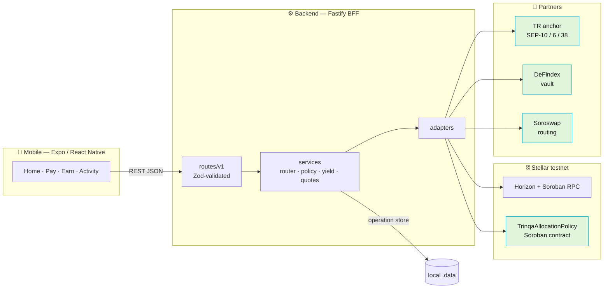
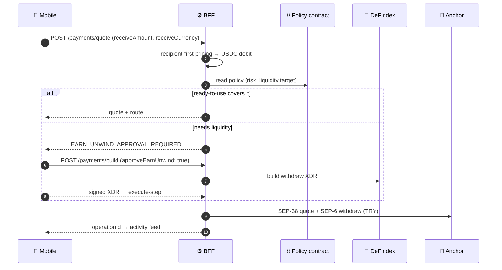

<div align="center">

<picture>
  <source media="(prefers-color-scheme: dark)" srcset=".github/assets/banner-dark.svg">
  <source media="(prefers-color-scheme: light)" srcset=".github/assets/banner-light.svg">
  
</picture>

<br/>

[](https://stellar.expert/explorer/testnet/contract/CAFTEI4RY7OOWIWTBHYGJV5SV7C6UEG5MKNQI77BZSQNB3AZPC5GMESP)
[](contracts/trinqa-policy)
[](backend)
[](apps/mobile)
[](../../actions/workflows/ci.yml)

**[Website](https://www.trinqa.com)** · **[Architecture](docs/backend/ARCHITECTURE.md)** · **[API](docs/backend/API.md)** · **[Integrations](docs/backend/INTEGRATIONS.md)** · **[Testnet evidence](docs/backend/TESTNET_EVIDENCE.md)** · **[FAQ](landing/faq.md)**

</div>

---

> **Trinqa is a self-driving portfolio.**
> Your money stays ready when you need it. Everything eligible and idle goes to work while you don't.

You set **risk**, **time horizon**, **liquidity need** and **intent**. Trinqa handles the rest — strategy eligibility, allocation, unwind, and money movement — over supported rails. Stellar, Soroban, anchors, vaults and swaps are plumbing, not the product.

|  | |
|---|---|
| ✅ **Trinqa is** | a portfolio that manages its own liquidity around your goals |
| ❌ **Trinqa is not** | a crypto wallet · an exchange · a trading terminal · a bank account · a payment wallet |

> [!IMPORTANT]
> Testnet only. Returns are not guaranteed; yield, liquidity and strategy risk change over time.

<br/>

## 🌊 The two states of a portfolio

<div align="center">
<picture>
  <source media="(prefers-color-scheme: dark)" srcset=".github/assets/flow-dark.svg">
  <source media="(prefers-color-scheme: light)" srcset=".github/assets/flow-light.svg">
  
</picture>
</div>

```
Total portfolio  =  Ready to use  +  Growing
```

| State | Meaning | Who decides |
|-------|---------|-------------|
| **Ready to use** | Spendable right now, no unwind needed | Your liquidity target, enforced on-chain |
| **Growing** | Eligible funds allocated to supported yield strategies | Policy + risk profile + target date |

When a payment is bigger than what is ready, Trinqa **unwinds only the difference** — it never treats the portfolio as one locked position. That unwind is an explicit, approved step (`EARN_UNWIND_APPROVAL_REQUIRED`), never a silent liquidation.

<br/>

## 🏗️ How it works



**Keys never leave the server.** The mobile app holds no partner API key, no anchor JWT and no Stellar secret — it holds a `sessionId` and a public address. Signing happens in the wallet (or, on testnet, in an env-gated demo signer that refuses to sign for anyone but its own account).

<details>
<summary><b>A payment, end to end</b></summary>

<br/>



Routes the engine can pick: `stellar_transfer` · `stellar_swap_transfer` · `fiat_payout`.

</details>

<br/>

## 🗂️ Repo map

```
trinqa/
├── apps/
│   ├── mobile/          📱 Expo Router app — 16 screens, 31 components, SwiftUI-flavoured shell
│   └── web/             🎨 Vite design-system explorer (token inventory + contrast audit)
├── backend/             ⚙️ Fastify BFF — 16 route modules, 33 test files
│   └── src/
│       ├── routes/v1/       HTTP + Zod validation
│       ├── services/        route planner · scorer · policy · yield · payments · custodial wallets
│       ├── adapters/        TR anchor · DeFindex · Soroswap · policy contract · Jev advisor
│       └── domain/          money, policy, route, operation types
├── contracts/
│   └── trinqa-policy/   🦀 Soroban `TrinqaAllocationPolicy` (Rust)
├── packages/tokens/     🎛️ Design tokens — primitives → semantic → product
├── landing/             🌐 trinqa.com (static build + product.md / faq.md / llms.txt)
├── docs/backend/        📚 API · architecture · integrations · testing · testnet evidence
├── scripts/             🔬 e2e + hackathon doctor / preflight / evidence runners
└── deployments/         📌 testnet.json — contract id + wasm hash (committed)
```

<br/>

## 🚀 Quickstart

<details open>
<summary><b>Prerequisites</b></summary>

| Tool | Version |
|------|---------|
| Node | ≥ 22 |
| pnpm | 10.16.1 |
| Rust | 1.98+ with `wasm32v1-none` |
| Stellar CLI | 23.x |
| Xcode / Android Studio | for native mobile builds |

</details>

**Backend (Fastify BFF)**

```bash
nvm use 22
cd backend
cp .env.example .env
pnpm install
pnpm dev            # → http://127.0.0.1:8787
```

**Mobile (Expo)**

```bash
cd apps/mobile
cp .env.example .env    # EXPO_PUBLIC_API_BASE_URL → your BFF
npm install
npm run ios             # or: npm start
```

> [!WARNING]
> The app uses Expo SDK 57 native modules — run a **dev build** (`expo run:ios`), not Expo Go.

**Contract**

```bash
cd contracts/trinqa-policy
rustup target add wasm32v1-none
cargo test
stellar contract build
../../scripts/deploy-policy.sh    # writes deployments/testnet.json
```

**Everything at once, from the repo root**

```bash
npm run dev    # backend + mobile metro
```

<br/>

## 🔌 API surface

Base URL: `http://127.0.0.1:8787` · every route under `/api/v1`.

<details>
<summary><b>Core</b> — health, capabilities, accounts, activity</summary>

<br/>

| Method | Path | Description |
|--------|------|-------------|
| `GET` | `/health` | Horizon, anchor, DeFindex, Soroswap, policy contract, demo signer |
| `GET` | `/capabilities` | Truthful rails — what is actually executable right now |
| `GET` | `/accounts/:id/balances` | Horizon balances |
| `GET` | `/accounts/:id/receive` | Receive payload + QR string |
| `GET` | `/operations/:id` | Normalized operation |
| `GET` | `/activity/:accountId` | Activity feed from the operation store |

</details>

<details>
<summary><b>Policy</b> — on-chain allocation intent</summary>

<br/>

| Method | Path | Description |
|--------|------|-------------|
| `GET` | `/policy/:accountId` | On-chain policy view |
| `POST` | `/policy/build` | Unsigned Soroban XDR |
| `POST` | `/policy/submit` | Submit signed XDR |

</details>

<details>
<summary><b>Yield & swaps</b> — DeFindex, Soroswap</summary>

<br/>

| Method | Path | Description |
|--------|------|-------------|
| `GET` | `/yield/recommendations/:accountId` | Ranked strategies for a target date (`?targetDate=` / `?daysToTarget=`) |
| `GET` | `/yield/strategies` · `/yield/positions/:accountId` | Normalized strategies and vault positions |
| `POST` | `/yield/deposits/build` · `/yield/withdrawals/build` | Unsigned deposit / withdraw XDR |
| `POST` | `/yield/execute` | Submit a signed DeFindex XDR against an `operationId` |
| `GET` | `/swaps/assets` | Testnet asset discovery |
| `POST` | `/swaps/quote` · `/swaps/build` | Exact-in/out quote and unsigned swap XDR |

Missing partner keys return `ADAPTER_UNAVAILABLE` instead of a fake answer.

</details>

<details>
<summary><b>Payments, anchors & routing</b></summary>

<br/>

| Method | Path | Description |
|--------|------|-------------|
| `POST` | `/payments/quote` | **Recipient-first**: you name what lands, the USDC debit is derived |
| `POST` | `/payments/build` | Build; `approveEarnUnwind: true` when the quote needs liquidity |
| `POST` | `/payments/execute-step` | Multi-step pay: `yield_withdraw` → `stellar_payment` / `soroswap_swap` / `anchor_withdraw` |
| `POST` | `/payments/submit` | Submit the signed classic tx |
| `GET` | `/anchors` | Every discovered anchor with SEPs, rails, and status |
| `GET` | `/routes/preview` | Scored route candidates, 0–100 per factor, with rejection reasons |
| `GET/POST` | `/anchor/*` | SEP-10 challenge → opaque `sessionId`, SEP-38 quotes, SEP-6 deposit/withdraw/status |

`routes/preview` reports **where each score came from** (`factorSources`) — computed vs advisor-suggested. `netCost` and `speed` are always computed.

</details>

Full reference: **[docs/backend/API.md](docs/backend/API.md)**

<br/>

## ⛓️ On-chain: `TrinqaAllocationPolicy`

Not a custodian — a **user-signed statement of intent** that the backend must respect.

| | |
|---|---|
| **Contract** | [`CAFTEI4RY…PC5GMESP`](https://stellar.expert/explorer/testnet/contract/CAFTEI4RY7OOWIWTBHYGJV5SV7C6UEG5MKNQI77BZSQNB3AZPC5GMESP) |
| **WASM hash** | `0ec6ee0b9d1ba56334e5f8a17221774cf2d7d38b470e8cc2fbe2af86aa7fba10` |
| **Network** | Stellar testnet |
| **Source** | [`contracts/trinqa-policy`](contracts/trinqa-policy) |

```rust
risk_profile          // 0–2
target_timestamp      // must be in the future on write
liquidity_target_bps  // 0–10_000 — how much stays Ready to use
automation_paused     // kill switch
allowed_strategies    // explicit allowlist
```

Every mutating call requires `user.require_auth()`. Storage TTL is extended on write.

<br/>

## 📊 What is actually live

Trinqa refuses to fake a rail. The `/capabilities` endpoint is the source of truth; this is what it reports today:

| Capability | Status | Notes |
|------------|--------|-------|
| USDC payments on Stellar | 🟢 **live** | Classic transfer, testnet |
| TRY on-ramp / off-ramp | 🟢 **live** | TR mock anchor, SEP-10 / 6 / 38 |
| On-chain allocation policy | 🟢 **live** | Deployed, read + write verified |
| DeFindex yield | 🟡 **key-gated** | Needs `DEFINDEX_API_KEY` + vault matching the Trinqa USDC SAC |
| Soroswap routing | 🟡 **key-gated** | Needs `SOROSWAP_API_KEY` |
| BRL payout | 🔴 **blocked** | Returns `NO_SUPPORTED_PAYOUT_RAIL` by design |

**Verified testnet transactions** (2026-09-19, `pnpm e2e:core` → PASS):

| Flow | Tx |
|------|-----|
| Anchor deposit TRY→USDC | [`b62fd23d…`](https://stellar.expert/explorer/testnet/tx/b62fd23da2e77caa5acb0e812225c63fbe800eb694162bd6f9d5643fc6794cd5) |
| Policy write / read | [`937b2a92…`](https://stellar.expert/explorer/testnet/tx/937b2a92498904b361b6a716f7ddf50b597cb9ccad1efca05088278dabbb27b8) |
| Direct USDC payment | [`d3d79481…`](https://stellar.expert/explorer/testnet/tx/d3d794811c6915abf2e2dcb9ffe249304d1fb866c74f1a1074a9f9c5642c6089) |
| Anchor withdrawal USDC→TRY | [`d7630723…`](https://stellar.expert/explorer/testnet/tx/d76307231d181bb09ebeacaa27f648ab69bb532dd65b1d2fb3988dc81f55194d) |

Full log: **[docs/backend/TESTNET_EVIDENCE.md](docs/backend/TESTNET_EVIDENCE.md)**

<br/>

## 🧪 Testing

```bash
cd backend
pnpm test               # 29 unit suites — money, policy, router, scorer, guards
pnpm test:integration   # 4 live-testnet suites (ephemeral Friendbot accounts)
pnpm e2e:core           # TRY deposit → policy write → USDC pay → TRY withdraw
pnpm e2e:defindex       # exit 2 when DEFINDEX_* is missing
pnpm e2e:soroswap       # exit 2 when SOROSWAP_API_KEY is missing
pnpm e2e:trinqa         # exit 3 = PARTIAL when partner keys are missing

cd ../contracts/trinqa-policy && cargo test
cd ../../apps/mobile && npx tsc --noEmit
```

Exit codes are deliberate: **2 = blocked on config**, **3 = partial**. A missing key never masquerades as a pass.

CI runs backend build + vitest, `cargo test`, and a mobile typecheck on every PR → [`.github/workflows/ci.yml`](.github/workflows/ci.yml)

<br/>

## 🎛️ Design system

`packages/tokens` is a three-layer token pipeline consumed by both the mobile app and the web explorer:

```
primitives/   raw observed values (color, space, radius, motion, shadow, typography)
    ↓
semantic/     roles — surface.canvas, action.primary, status.danger …
    ↓
product/      component-level composition
```

Brand action colour `#08AFD3`. Run the explorer with `npm run dev:web` to browse the inventory, contrast audit and component matrix.

<br/>

## 📚 Docs

| | |
|---|---|
| [API reference](docs/backend/API.md) | Every `/api/v1` route, payload and error code |
| [Architecture](docs/backend/ARCHITECTURE.md) | Layers, request flow, policy and payment design |
| [Integrations](docs/backend/INTEGRATIONS.md) | Network values, anchor, DeFindex, Soroswap, router |
| [Mobile wiring](docs/backend/MOBILE_WIRING.md) | How the Expo app talks to the BFF |
| [Testing](docs/backend/TESTING.md) | Unit, integration, e2e and contract suites |
| [Testnet evidence](docs/backend/TESTNET_EVIDENCE.md) | Signed, timestamped run log with tx hashes |
| [Partner keys](docs/backend/PARTNER_KEY_FALLBACK.md) | Behaviour when partner credentials are absent |

<br/>

## 🔒 Security posture

- Boot **fails** unless `STELLAR_NETWORK=testnet` — no accidental mainnet.
- Partner keys and `DEMO_SIGNER_SECRET` live in env only; never in git, never on the device.
- Anchor JWTs stay server-side; mobile only ever sees an opaque `sessionId`.
- Demo signer routes are env-gated, return `403` when disabled, and refuse to sign for any account other than their own. Device wallet seeds are derived as `HMAC(master, walletKey)` and are never stored.
- The operation store writes to a gitignored `.data/` directory.

<br/>

---

<div align="center">

<sub>Built on **Stellar** · Soroban allocation policy · SEP-6/10/38 anchors · DeFindex vaults · Soroswap routing</sub>

<br/><br/>

<sub>**Not investment advice.** Returns are not guaranteed. Yield, liquidity and strategy risk can change at any time.<br/>Testnet software — do not use with real funds.</sub>

<br/>

<sub>© Trinqa · [trinqa.com](https://www.trinqa.com)</sub>

</div>
