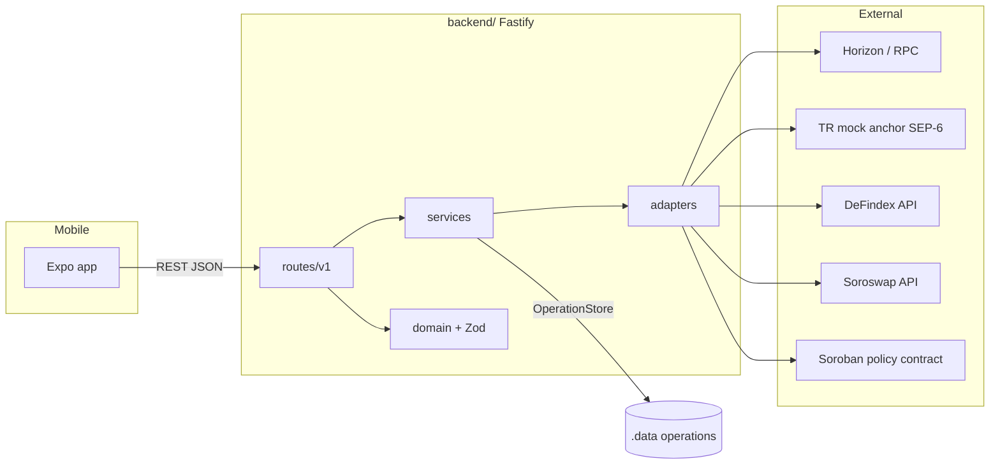

# Backend Architecture (testnet)

## Layers

| Layer | Role |
|-------|------|
| `routes/v1/*` | HTTP API (Fastify), Zod validation |
| `services/*` | Orchestration (Stellar, anchor, policy) |
| `adapters/*` | External systems (TR mock anchor, Soroban policy contract) |
| `domain/*` | Pure types and validation |
| `config/*` | Env + committed testnet deployment metadata |

## Policy flow (M2)

1. Mobile calls `GET /api/v1/policy/:accountId` → `PolicyService` → `TrinqaPolicyAdapter` simulates `get_policy` on Soroban.
2. Mobile calls `POST /api/v1/policy/build` with a typed action → unsigned XDR for wallet signing.
3. Mobile (or demo signer) submits `POST /api/v1/policy/submit` with signed XDR → Soroban RPC.

Contract source: `contracts/trinqa-policy/contracts/trinqa-allocation-policy`.  
Deployed metadata: `deployments/testnet.json` (no secrets).

## Security boundaries

- Testnet only (`STELLAR_NETWORK=testnet` enforced at boot).
- Partner keys and demo signer secrets stay in env, never in git.
- Demo signer routes and auto-sign helpers are env-gated.

## Request flow (M3–M4)

## Yield & routing

- **Recommendations:** `GET /api/v1/yield/recommendations/:accountId` — deterministic risk engine + on-chain policy `target_timestamp` (unix seconds) or query `targetDate` / `daysToTarget`.
- **Payments:** `PaymentRouter` scores route candidates; quotes expose `candidateCount` and `routeScore` (TRY fiat payout typically `candidateCount: 1`).
- **Activity:** `OperationStore` entries normalized for mobile transaction feed (`operationId`, `txHash`, anchor refs).
