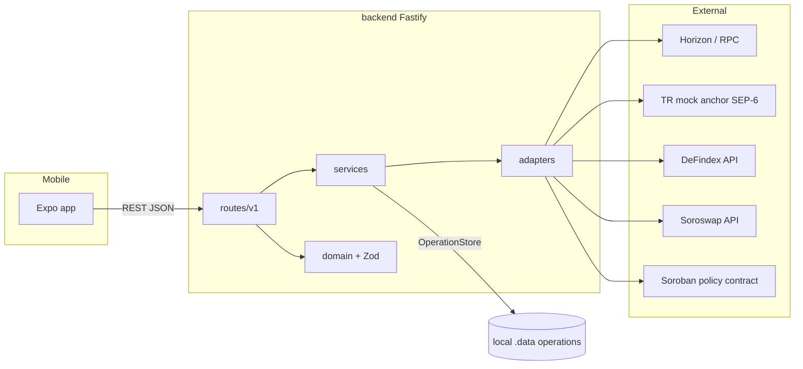

# Backend architecture (testnet)

## Layers

| Layer | Role |
|-------|------|
| `routes/v1/*` | HTTP API (Fastify), Zod validation |
| `services/*` | Orchestration (Stellar, anchor, policy, payments, yield, swaps) |
| `adapters/*` | TR mock anchor, DeFindex, Soroswap, Soroban policy contract |
| `domain/*` | Money, policy, route types and validation |
| `config/*` | Env + committed `deployments/testnet.json` |

## Request flow

## Policy

1. `GET /api/v1/policy/:accountId` → `PolicyService` → simulate `get_policy`.
2. `POST /api/v1/policy/build` → unsigned XDR.
3. Wallet or testnet demo signer → `POST /api/v1/policy/submit`.

Contract source: `contracts/trinqa-policy`. Deployed id/hash: `deployments/testnet.json`.

## Payments

- Recipient-first quotes: USDC debit derived from receive amount/currency.
- TRY on-ramp/off-ramp via TR mock (SEP-10/6/38).
- BRL → `NO_SUPPORTED_PAYOUT_RAIL`.
- Earn-funded pay requires an explicit unwind; blocked if DeFindex is unconfigured.

## Security

- Boot fails unless `STELLAR_NETWORK=testnet`.
- Partner keys and `DEMO_SIGNER_SECRET` stay in env, never in git, never on mobile.
- Demo signer routes are env-gated and refuse to sign for any account except the demo public key.
- Anchor JWTs stay on the server; mobile stores `sessionId` only.
